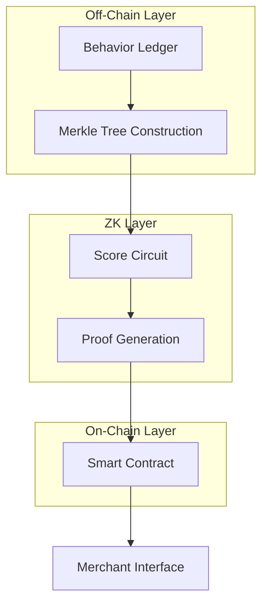

# Aura Protocol

## 1. Executive Summary

**Track Selected:** The "Web3 Credit & BNPL" Problem

**One-Liner:** We built the "Visa Clearing Layer" for Web3—enabling instant, under-collateralized credit using Zero-Knowledge proofs so users never have to unstake assets to make a purchase.

**Team Name:** Blade Runners

**The Problem in One Sentence:** DeFi is currently broken because it treats every user like a criminal who must lock up $150 just to borrow $100, effectively killing capital efficiency and making "real-world" commerce impossible on-chain.

---

## 2. Market Research & Validation

### Why this project needs to exist (The "Hard Truth")
The global economy runs on credit, not cash. When you buy a coffee, you don't wire money instantly; a bank vouches for you, and the money moves later. This "trust gap" is what makes commerce fast.

Web3 has failed to replicate this. Currently, DeFi operates on a "Pawn Shop" model. If you want credit, you have to over-collateralize (lock up more than you borrow). This is useless for payments. No one is going to lock up $500 in ETH just to buy a $50 subscription. Because of this, Web3 users are forced to hoard liquid cash (stablecoins) or suffer the pain of unstaking assets every time they want to buy something. We are fixing this broken financial physics.

### Target Audience (Who actually needs this?)
We aren't targeting the "average Joe" yet. We are targeting the "Illiquid Whale"—the DeFi Power User.

* **The Staker:** Someone who has $50k in ETH staked in Lido or EigenLayer. They are rich on paper but "poor" in their wallet. They shouldn't have to unstake (and lose yield) just to mint a generic NFT or pay for gas.
* **The DAO Contributor:** Someone who gets paid in tokens at the end of the month but needs to pay rent or buy tools today.

### Competitor Analysis (Why we win)
Most competitors are solving the wrong problem or solving it poorly.

**VS. Aave & Compound (The "Pawn Shops")**
* **Their Model:** You must deposit $150 to borrow $100.
* **The Flaw:** This is capital inefficiency. It doesn't help you buy things; it only helps you leverage.
* **Our Edge:** **True Under-collateralization.** We let you spend based on your history and reputation, not just your locked assets.

**VS. Web2 BNPL (Klarna, Slice)**
* **Their Model:** They give you credit, but they harvest your data, sell your transaction history to advertisers, and have zero interoperability with crypto.
* **The Flaw:** They are privacy nightmares and can't touch smart contracts.
* **Our Edge:** **Zero-Knowledge Privacy.** We prove you can pay without revealing what you own or where you got it. The merchant gets a "Yes/No," not a bank statement.

**VS. On-Chain Identity (Gitcoin Passport, Galxe)**
* **Their Model:** They give you a "Score" or a badge.
* **The Flaw:** A score is useless if you can't spend it. They are just "Reputation," not "Money."
* **Our Edge:** **Execution.** We don't just give you a score; we give you a Line of Credit backed by a liquidity pool that actually settles the transaction.

### User Persona: "The Frustration of Rahul"
Rahul is a DeFi native. He finds a rare NFT mint that is happening right now for 0.2 ETH.

* **The Pain:** Rahul has 10 ETH, but it's all staked in a validator node to earn 4% APY. To get that 0.2 ETH liquid, he would have to unstake (wait 3 days) or bridge funds from his bank (wait 24 hours). By then, the mint is sold out. He has the money, but he can't use it.
* **The Solution:** Rahul connects his wallet to Aura. The protocol sees his 3-year history of honest on-chain behavior. It generates a ZK-proof of his creditworthiness. He clicks "Pay with Credit." The transaction goes through instantly. Rahul gets the NFT. He pays back the 0.2 ETH next week when his staking rewards drop. Zero friction. Zero opportunity cost.

---

## 3. The Solution & Innovation

### Core Value Proposition: The "Web3 Credit Clearing House"
We have built the world’s first Privacy-Preserving Clearing House for crypto. Current blockchain payments are "Atomic Settlement"—meaning if you buy a coffee, the money must leave your wallet the exact second you scan the code. This is inefficient. Aura Protocol decouples the Purchase from the Payment:

* **The Innovation:** We introduce a layer of "Cryptographic Trust" between the buyer and merchant. The merchant accepts a ZK-Signed Receipt (a digital promise) instantly, knowing the protocol guarantees settlement +24 hours later.
* **The Result:** This allows us to offer **True Under-Collateralized Credit**. Because we control the settlement engine, we can allow a user with a high "Reputation Score" to spend beyond their current liquid balance, effectively creating money velocity on-chain.

### The "Magic Moment" (The User Experience)
Imagine this: A user stands at a checkout counter for a Web3 conference ticket.

* **The Old Way:** They realize they are short on USDC. They have to open Uniswap, swap some ETH for USDC (pay gas), wait for approval (pay gas), then pay the merchant (pay gas). Total time: 5 minutes. Total friction: High.
* **The Aura Way:** They scan the QR code. The protocol runs a background check on their 3-year wallet history. A sleek prompt appears: *"Credit Limit: 500 USDC. Pay Next Month?"*
    * They tap "Confirm" once.
    * Done.
* The user walks away with the ticket. The merchant sees "Payment Guaranteed." The friction didn't just disappear; it was engineered out of existence.

### Unique Selling Point (USP): The "Zero-Knowledge Trust Paradox"
Every other credit experiment in Web3 fails for one of two reasons:
1.  **Too Risky:** They lend to anonymous wallets who run away (Defaults).
2.  **Too Invasive:** They demand KYC (Passport/ID), breaking the ethos of crypto.

Aura is the only protocol that solves this paradox using Zero-Knowledge Proofs. We use a ZK-Circuit (Groth16) to prove a user is creditworthy without revealing their identity or financial history.

* **The Merchant asks:** "Can this user pay back $50?"
* **The Protocol answers:** "Yes. Here is a mathematical proof that their repayment history score is >750."

**The Breakthrough:** We verify the probability of repayment without ever exposing the user's wallet balance or debt positions to the public. It is a "Private Credit Bureau" that lives in the math, not in a server.

### Success Metric
**The "Utilization Ratio":** Our success isn't just Total Value Locked (TVL); it's **Capital Velocity**. If our pool has $1M liquidity, but facilitates $10M in transaction volume per month via credit recycling, we have won.

---

## 4. Technical Feasibility & Architecture

**Show us the "engine" under the hood.**

Our architecture is a Hybrid "Off-Chain Compute, On-Chain Settlement" Engine. We refuse to run heavy credit computations on Ethereum (which is slow and public). Instead, we run them in a high-speed trusted execution environment and anchor the truth to Ethereum.

### System Architecture:-

```mermaid
sequenceDiagram
    participant U as User Wallet
    participant Z as ZK Engine
    participant L as Off-Chain Ledger
    participant C as Ethereum Contract
    participant M as Merchant
    participant S as Settlement Engine

    U->>Z: Request Credit Approval
    Z->>L: Fetch User Behavior & Compute Score
    L-->>Z: Immutable Data Verified
    Z->>C: Commit ZK Proof + Score
    C->>M: Validate Credit Proof
    M-->>U: Instant Approval
    S->>L: Update Ledger Post Settlement
   ```
**1. The "Shadow Ledger" (Off-Chain Oracle - Node.js)**
This is the brain of the system. It is not a standard database; it is an Append-Only Merkle Tree.
* **How it works:** Every user action (Borrow, Repay, Default) is a "Leaf" in this tree.
* **Immutability:** Each new action is hashed with the previous history. This creates a cryptographic chain of custody. Even if a user generates a new private key, they cannot erase their past "Default" events because the Merkle Root of this tree is periodically anchored to Ethereum.
* **Role:** It acts as the "Single Source of Truth" for credit scores, but it never holds the money.

**2. The "Privacy Shield" (ZK-Circuits - Circom 2.0)**
When a user requests a loan, the Client App generates a Zero-Knowledge Proof locally.
* **Circuit Logic:** We use a custom Circom circuit that takes the User's Private History and the Public Merkle Root as inputs.
* **The Constraint:** `assert(HistoryScore > Threshold)` and `assert(User != Blacklisted)`.
* **The Output:** A lightweight Groth16 Proof (only ~200 bytes). This proof tells the smart contract "Authorize this loan" without revealing why the user is trusted.

**3. The "Settlement Vault" (Smart Contract - Ethereum Sepolia)**
This is the "Bank." It holds the Liquidity Pool (USDC) and enforces the rules.
* **Batch Settlement:** Instead of processing every $5 coffee purchase on-chain (which costs $2 in gas), the Vault processes Aggregate Batches.
* **The Flow:** At 00:00 UTC, the Oracle submits a batch of 1,000 receipts. The Contract verifies the signatures and releases funds to 1,000 merchants in one atomic transaction.

### Tech Stack
* **Blockchain:** Ethereum Sepolia (Layer 1 Security & Finality).
* **ZK Engine:** Circom 2.0 + SnarkJS. We chose Groth16 over Plonk because it has the smallest proof size, which minimizes the gas cost of on-chain verification.
* **Backend:** Node.js (Raw). We avoided TypeScript to strip away compilation overhead. We use raw buffer manipulation for high-speed Merkle Hashing (Poseidon Hash).
* **Storage:** IPFS + JSON. The Merkle Tree leaves are stored on IPFS for decentralized availability, ensuring no centralized server can "hide" a user's bad history.

### Key Technical Challenge: The "Liquidity Run" (The Synchronization Gap)
* **The Problem:** Since authorizations happen off-chain instantly, but settlements happen on-chain 24 hours later, the Ethereum Vault doesn't know its "True Balance" in real-time. A Lender could panic and withdraw their 10,000 USDC after a merchant has been promised payment, leaving the protocol insolvent.
* **The Solution:** We engineered a "Seniority-Based Exit Queue" in the Smart Contract.
    * **Senior Debt (Merchants):** Merchant claims are processed instantly. They have first right to the liquidity.
    * **Junior Equity (Lenders):** Lender withdrawals are placed in a 12-Hour "Cool-Down" Queue.
* **The Logic:** `if (Total_Assets - Pending_Merchant_Claims < Withdrawal_Amount) REVERT`.
* **The Result:** This forces Lenders to wait long enough for all pending Merchant receipts to clear. The "Used Funds" always exit the building before the "Idle Liquidity" can flee. This mathematically guarantees that a merchant never faces a bad debt due to a liquidity crunch.

---
## 5. Github Repository: https://github.com/xpert0/aura-protocol

## 6. Business Model & Future Roadmap

### Monetization Strategy: The "Credit Multiplier" Engine
We operate on a hybrid model that combines Payment Gateway Fees (Volume) with Lending Spreads (Yield). This dual-engine ensures we make money even if users pay back on time.

**Merchant Discount Rate (MDR) - 1.5%**
* **The Logic:** Traditional BNPL (Klarna/Affirm) charges merchants 3-6%. We charge only 1.5%.
* **Why Merchants Pay:** We bring them "Illiquid Whales"—customers who have wealth but no cash. By recovering these "Lost Sales" (Cart Abandonment), the merchant happily pays the small fee.
* **Revenue Projection:** On $10M Monthly Volume -> $150,000/mo Revenue.

**Net Interest Margin (NIM) - The Spread (7%)**
* We pay Lenders (Liquidity Providers) 5% APY to attract deep capital.
* We charge Borrowers (Credit Users) 12% APR on unpaid balances after the 30-day grace period.
* The Protocol keeps the 7% Spread to cover insurance funds and operational profit.

**Liquidation & Late Fees**
* If a user defaults, their ZK-Score is slashed, and they are permanently blacklisted.
* A 5% Liquidation Penalty is added to their debt. When (or if) they eventually repay to restore their reputation, this 5% goes directly to the Insurance Fund to cover system bad debt.

### Compliance & Regulatory Path (India Context)
We are building Aura to be FIU-IND (Financial Intelligence Unit) compliant from Day 1, treating this as a serious Fintech product, not a "Degen App."

### Economic Sustainability & Risk Mitigation (Why this works)
We anticipated the two biggest risks in Web3 credit and engineered solutions for them.

**Risk 1: "Who pays the Gas?" (The Unit Economics Problem)**
* **The Challenge:** If buying a $5 coffee costs $2 in Ethereum gas, the business model fails.
* **Our Solution:** Batch Settlement Aggregation. We do not settle transactions one-by-one. Our Oracle bundles 1,000+ merchant receipts into a single Merkle Root submission at midnight.
* **The Math:** $5 Gas / 1,000 Transactions = $0.005 per transaction. This makes our unit economics profitable even on micro-payments.

**Risk 2: "What if everyone defaults?" (The Trust Problem)**
* **The Challenge:** Since loans are under-collateralized, a user could just walk away.
* **Our Solution:** The "Identity Premium" Thesis. We only lend to wallets with >2 years of history and significant activity (ENS, Airdrops, NFT holdings).
* **The Reality:** A user will not burn a "Main Wallet" with 3 years of history (and future airdrop potential) just to steal $50. The value of their On-Chain Reputation is higher than the credit limit we offer. We leverage this behavioral economics to keep default rates low.

### The "Next 6 Months" Roadmap
If we win this hackathon, here is our execution plan to Mainnet:

* **Month 1-2: Audit & Security**
    * **Objective:** Zero critical vulnerabilities.
    * **Action:** Commission a formal audit of our Circom Circuits (ensuring no fake proofs can be generated) and our Solidity Vault (stress-testing the "Seniority Exit Queue" logic against bank-run simulations).

* **Month 3: "Gasless" Upgrades (UX Overhaul)**
    * **Objective:** Make the crypto invisible.
    * **Action:** Integrate ERC-4337 (Account Abstraction). Currently, users sign a transaction manually. In V2, users will authorize a $500 crypto credit payment using just FaceID (Passkeys) on their iPhone, with the protocol subsidizing the gas via a Paymaster.

* **Month 4-5: The Merchant SDK & Cross-Chain Expansion**
    * **Objective:** Distribution—making it easy for any shop to add Aura.
    * **Action 1 (The SDK):** Release `@aura-protocol/sdk` on npm. This allows any dApp or NFT marketplace to add a "Pay with Credit" button with just 2 lines of React code.
    * **Action 2 (The Plugins):** Launch a Shopify Plugin and a Telegram Payment Bot. This lets Web2 merchants accept Web3 credit without needing to know what a "smart contract" is.
    * **Action 3 (L2 Settlement):** Deploy the Settlement Vault on Polygon & Base. This reduces the daily batch settlement gas cost from ~$15 (Ethereum) to ~$0.05, drastically improving our profit margins.

* **Month 6: Institutional Pools**
    * **Objective:** Unlimited Liquidity.
    * **Action:** Partner with a DAO or a Stablecoin issuer (like Circle) to provide the initial $10M Liquidity Tranche, transitioning the protocol from a "Peer-to-Peer" model to a scalable "Institutional Credit" model.
